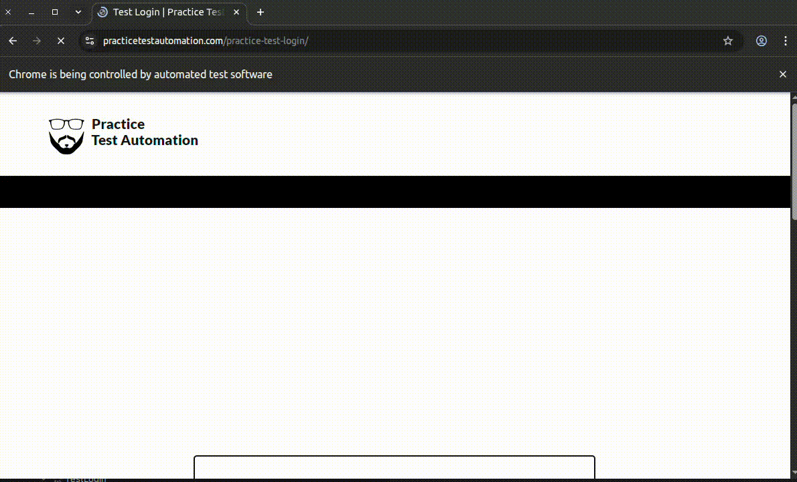
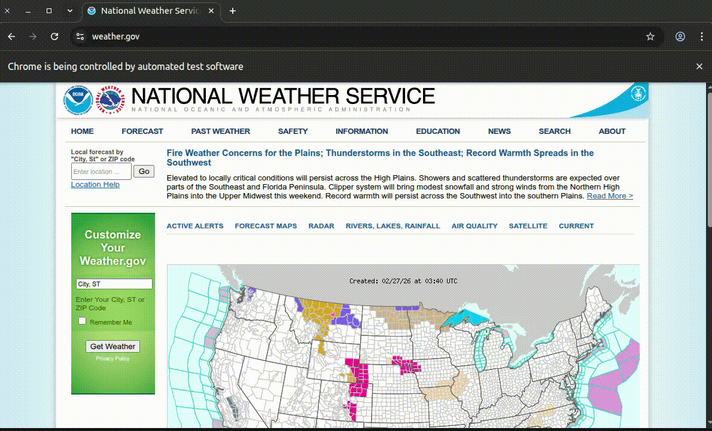
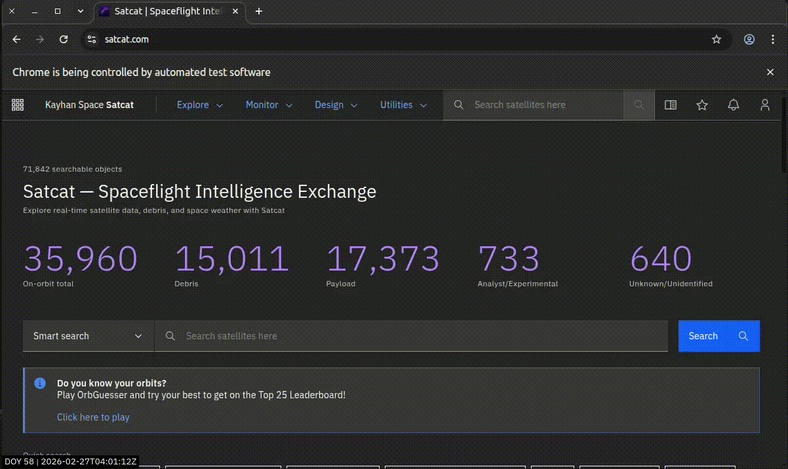
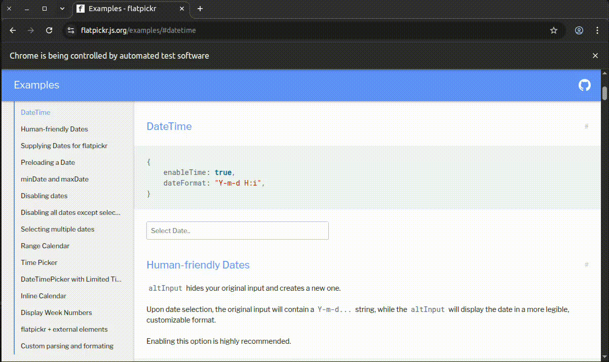
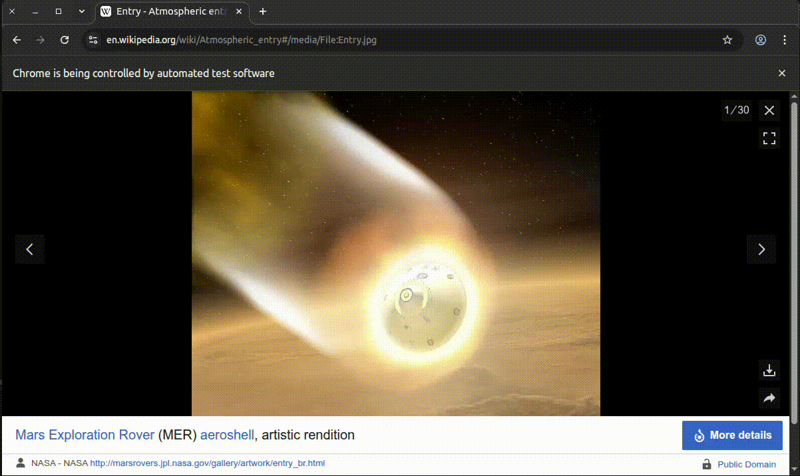

# selenium-wrapper

A light-weight Python wrapper to write Selenium browser tests and run them in a Docker container.

## Getting Started
`selenium-wrapper` is a Python package that provides a simple and intuitive interface for writing Selenium browser tests. It abstracts away the complexities of Selenium and allows you to focus on writing your test logic. The `browser` is a standard `pytest` fixture which initializes a Chrome browser, and captures console logs at the end of the test.

#### A simple example to log in to a website:
See the `tests/test_samples/test_login.py` for full working example.
```python
browser.navigate("https://practicetestautomation.com/practice-test-login/")
for element in login.elements:
    browser.wait_for_element(element)
browser.input_text(login.username, "student")
browser.input_text(login.password, "Password123")
browser.click(login.submit)
browser.wait_for_element(login.logout)
```


#### Examples to search with dropdown:
See the `tests/test_samples/test_weather_gov.py` for full working example.
:warning: Do not abuse the `weather.gov` website. Use the example for learning purposes only.
```python
browser.navigate("https://www.weather.gov/")
browser.search_with_dropdown(weather_gov.search_box, "33040", weather_gov.first_search_result)
browser.wait_for_element(weather_gov.current_conditions)
location_text = browser.get_element_text(weather_gov.current_location)
```


See the `tests/test_samples/test_satcat.py` for full working example.
```python
browser.navigate("https://www.satcat.com/")
browser.wait_for_element(satcat.search_input)
norad_id = "25544"
browser.search_with_dropdown(satcat.search_input, norad_id, dynamic_search_result(norad_id))
browser.wait_for_element(satcat.cds_tabs_list)
assert "sats/25544" in browser.driver.current_url
```


See the `tests/test_samples/test_flatpickr.py` for full working example.
```python
browser.navigate("https://flatpickr.js.org/examples/#datetime")
browser.use_datepicker(TimeDif(day_offset=90).iso(), timestamp, skip_seconds=True)
```


See the `tests/test_samples/test_wiki_image_download.py` for full working example.
```python
browser.navigate("https://en.wikipedia.org/wiki/Atmospheric_entry#/media/File:Entry.jpg")
browser.wait_for_element(wikipedia_image.download_icon)
browser.use_dropdown(wikipedia_image.download_icon, wikipedia_image.download_btn)
browser.read_file(pattern="*.jpg", binary=True, timeout=10)
```


## Setup Instructions
- Clone the repository.
- Set up a virtual environment (Python `3.12`, `3.13`, or `3.14`).
- Install the required dependencies
  - using uv: `uv sync`, or
  - using pip: `pip install -r requirements.txt`

## Running Tests inside Docker Container
- You must have a `.env` file in the root directory with the following variables:
```
# HEADLESS should be always be set to True for running in Docker container
HEADLESS=True

# Additional configuration
NUM_CORES=2
```
- To run the tests in the Docker container, run:
```
docker compose up --build
```
